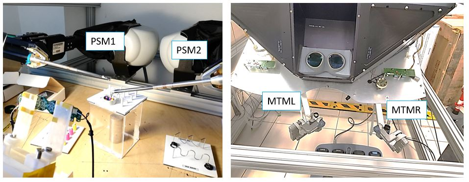

------------------------------------------------
Robotic Surgical Maneuver Dataset
================================================

<b>ROSMA</b> is a surgical robotics dataset of three common training surgical tasks collected from the Da Vinci Research Kit (dVRK). ROSMA contains data from 207 trials of three maneuvers performed by 12 users. Data includes 160 kinematic variables recorded at 50 Hz along with video recordings collected at 15 frames per second with 1024 x 768 pixel resolution.


<div align="right">
<a href="https://zenodo.org/records/3932964">

</a>
</div>
<br>


<b>ROSMAT22</b> is a subset of ROSMA dataset that includes annotations for surgical tools detection on 22 tasks. 

<b>ROSMATG40</b> is a subset of ROSMA dataset that includes annotations for instruments basic actions on 40 tasks. 


## Dataset recording

<div align="center">
<a href="(https://www.youtube.com/watch?v=gEtWMc5EkiA)">

</a>
</div>

## <u>Research Papers</u>
 [](https://github.com/CAMMA-public/rendezvous)
 
## Contents
The ROSMA dataset folder includes:
  - **videos**/: 207 videos of surgical tasks using the dVRK
  - **kinemtics**/: 106 kinematic variables of the dVRK components for the 207 tasks
  - **labels**/: instruments' gesture and bounding box
  - a **scores** text file
  - a **synchronizationData** text file
  - a **users** text file
  - a **LICENCE** file
  - a **README** file

<br>

<details>
  <summary>  
  <b>Expand to view the dataset directory structure: </b>
  </summary>
  
  ```
    ──ROSMA
        ├───videos
        │   ├───X01_task_trial.mp4  
        │   ├───
        │   └───X12_task_trial.mp4
        |
        ├───kinematics
        │   ├───X01_task_trial.txt 
        │   ├───
        │   └───X12_task_trial.txt  
        |
        ├───labels
        │   ├───X01_task_trial.txt 
        │   ├───
        │   └───X12_task_trial.txt  
        |
        ├───scores.txt   
        ├───synchronizationData.txt    
        ├───userQuestionnaire.txt
        ├───LICENSE
        └───README.md
   ```
</details>

<br>

------------------------------------------------
Videos
================================================

------------------------------------------------
Kinematic Data
================================================

------------------------------------------------
Labels
================================================

### Heramientas
Se han etiquetado 22 vídeos de la tarea Pea on a Peg

### Gestures
- G1: pinza parada o en espera (no tiene porque estar absolutamente quieta, pero que no esté haciendo nada relevante. Lo digo porque hay veces que la persona no está moviendo la pinza, pero como tiene el haptic cogido con la mano, se mueve algo).

- G2: Pick, que sería cuando la pinza coge un objeto (ya sean los cilindros o las bolas del pea on a peg)

- G3: Place, el equivalente pero cuando se suelta el objeto. 

- G4: Desplazamiento de la pinza sin tener nada cogido. 

- G5: Desplazamiento de la pinza cuando tiene un objeto cogido.

- G6: Colaboración entre las dos pinzas. En el caso de post and sleeve, es cuando se pasa el objeto de una pinza a otra, y en el caso de pea on a peg cuando una pinza ayuda a la otra a quitarse bolitas cuando se agarra mas de una.

Se han etiquetado los siguientes usuarios, para las tareas de Post and Sleeve y Pea on a Peg:

X01, X02, X06, X07 y X08, los trials 1, 2, 3, 4. 20 vídeos por tarea -> 40 vídeos en total. 


Para la licencia:

https://chooser-beta.creativecommons.org/
